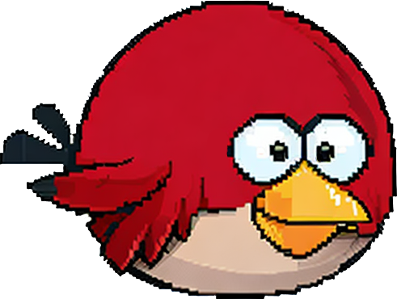

    

        
        <h1 align="center">Flappy Wings (Angular)</h1>
    

	
A browser game based on the popular mobile game "Flappy Bird"

    

---

Flappy Wings is a canvas-based browser game with PWA capabilities, based on the popular mobile game "Flappy Bird" developed by Vietnamese game developer Dong Nguyen. The objective of the game is straightforward: players control a small bird character and must navigate it through a series of obstacles. The bird automatically moves forward, and players can make it flap its wings by tapping on the screen or pressing a button. Each flap causes the bird to ascend slightly, and when the player stops tapping, the bird descends due to gravity.

## Installation

To install Flappy Wings, follow these steps:

- Clone the repository to your local machine.
- Install the dependencies by running `yarn install --ignore-engines`.
- Start the development server by running `yarn start`.
- Navigate to http://localhost:4200/ in your web browser.

## Usage

To play Flappy Wings, simply navigate to the URL where the game is hosted. The game will automatically start, and you can control the bird by tapping on the screen or pressing the spacebar.

## Features

Flappy Wings includes the following features:

- Canvas-based graphics
- Simple one-button gameplay
- Randomly generated obstacles
- Seed based randomness
- PWA capabilities

## Contributing

If you'd like to contribute to Flappy Wings, please fork the repository and create a pull request. You can also open an issue if you find a bug or have a feature request.

## Credits

The game is based on "Flappy Bird" developed by Dong Nguyen. The assets used in this project were generated using [AUTOMATIC1111 Stable Diffusion web UI](https://github.com/AUTOMATIC1111/stable-diffusion-webui).
